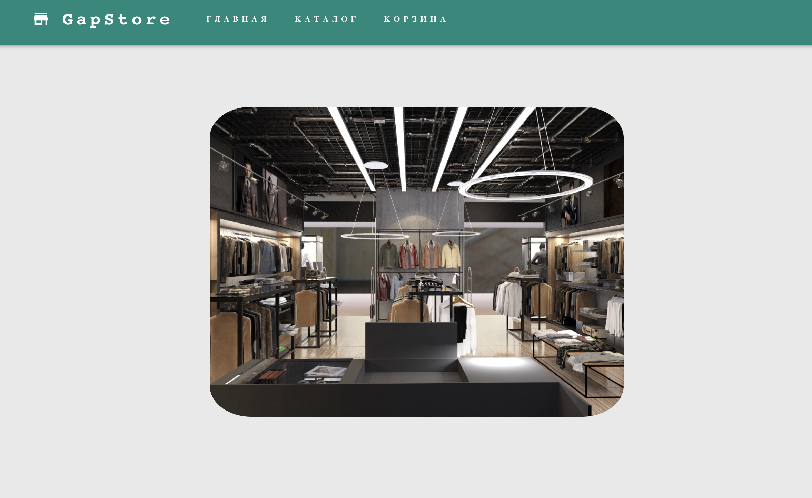
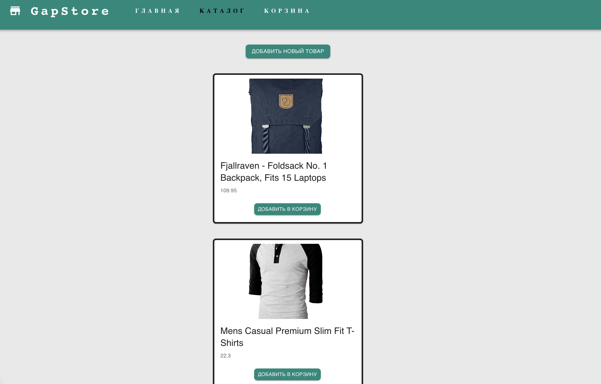
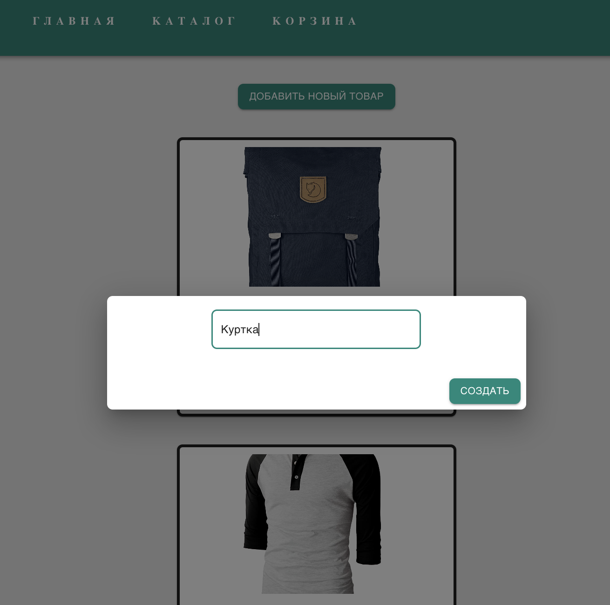
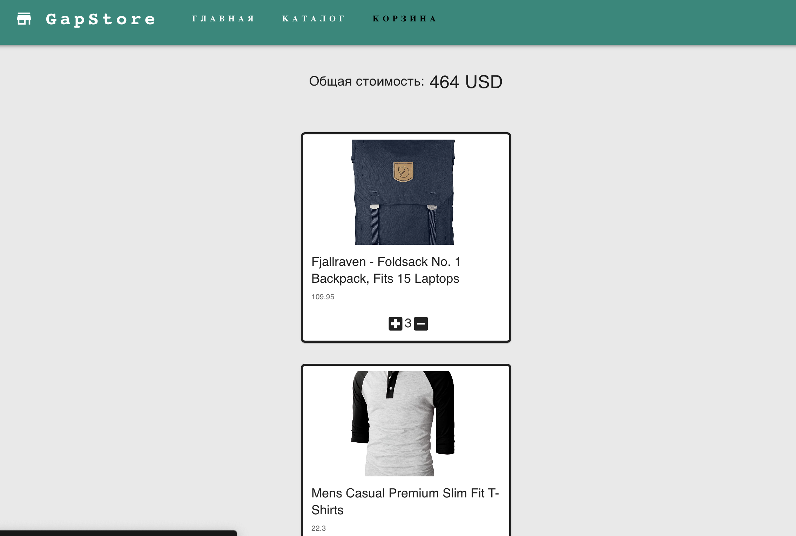

# Kapibara
Для запуска в браузере необходимо:

Открыть терминал

Необходимо скачать зависимости командой
- npm install

Запустить командой 
- npm start

Проект можно посмотреть по ссылке https://igorgap.github.io/Kapibara/

На сайте есть меню навигации с разделами "Главная","Каталог" и "Корзина".

Перейдя в раздел "Каталог" мы видим различные товары и кнопку добавить товар

Нажав на кнопку появляется модальное окно в котором нужно ввести название нового товара. Таким образом мы в наш Каталог можем добавить много других позиций.

Перейдя в раздел корзина, мы видем все товары которые были добавлены сюда. На самой карточке товара есть Название товара и цена, а так же мы можем увеличить число товаров нажав на + или уменьшить нажав на - Так же мы увидим общую стоимость всех товаров в корзине

